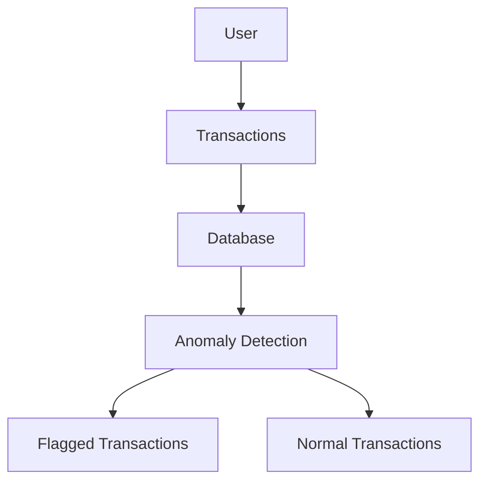

# Banking Anomaly Detection System

This project simulates banking transactions and finds suspicious activity.

Example:
- very high amount
- too many transactions
- strange timing

## System Flow

## What this system does

This system:
- generates banking transactions
- stores them in a database
- checks for suspicious activity
- flags unusual transactions

## Types of anomalies

- high amount transactions
- too many transactions in short time
- unusual time activity
- different location usage
- **Fee Evasion:** Users in a low tier (Silver) somehow getting zero fees.
- **Global Velocity:** High-frequency transfers to international locations (Italy/Mexico).